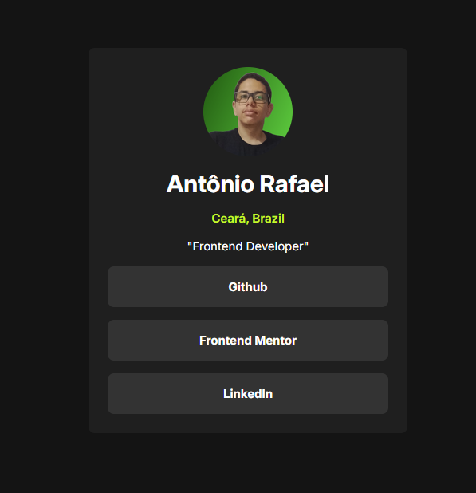

<h1 align="center"> Frontend Mentor - Solução de Links de Perfil </h1>

Essa é uma solução para o [Desafio Links de Perfil no Frontend Mentor](https://www.frontendmentor.io/challenges/social-links-profile-UG32l9m6dQ). Os desafios do Frontend Mentor ajudam você a aprimorar suas habilidades de programação por meio da criação de projetos realistas.

    

## 💻 Projeto

Este projeto é uma árvore de links para redes sociais

## 🚀 Tecnologias

Esse projeto foi desenvolvido com as seguintes tecnologias:

- HTML
- CSS
- Git e GitHub

### O Que Aprendi

- Organização e Estruturação de HTML semântico
- Estilização com pseudoseletores `:hover` e `:active`
- Uso de funções CSS
- Estilização mobile-first

### Links
- Acesse a URL da solução [clicando aqui](https://github.com/Antonio-Rafael-Silva/projeto-social-links)
- Acesse o site do projeto [clicando aqui](https://antonio-rafael-silva.github.io/projeto-social-links/)

## Screenshot do resultado

### Versão Final

 
    

## Autor 

- Website - [Antônio Rafael](https://antonio-rafael-silva.github.io/projeto-social-links/)
- Frontend Mentor - [@Antonio-Rafael-Silva](https://www.frontendmentor.io/profile/Antonio-Rafael-Silva)
- Linkedin - [Antônio Rafael](https://www.linkedin.com/in/ant%C3%B4nio-rafael-01131b372/)